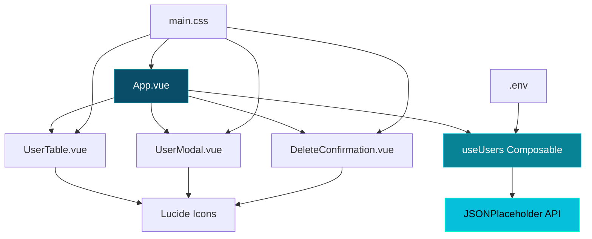
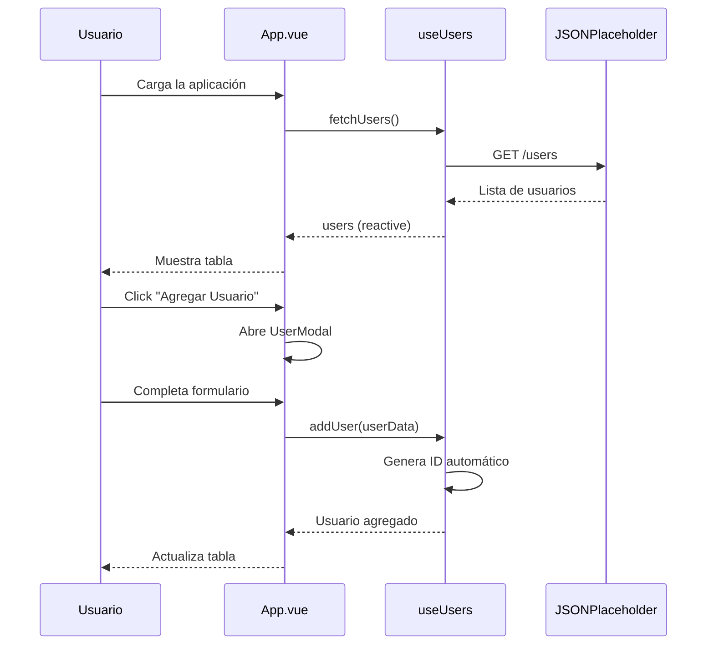
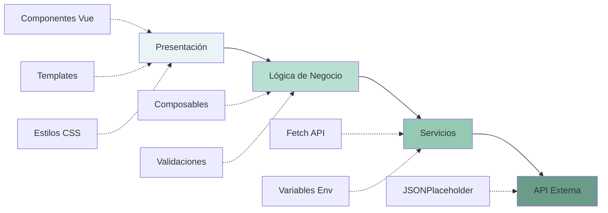
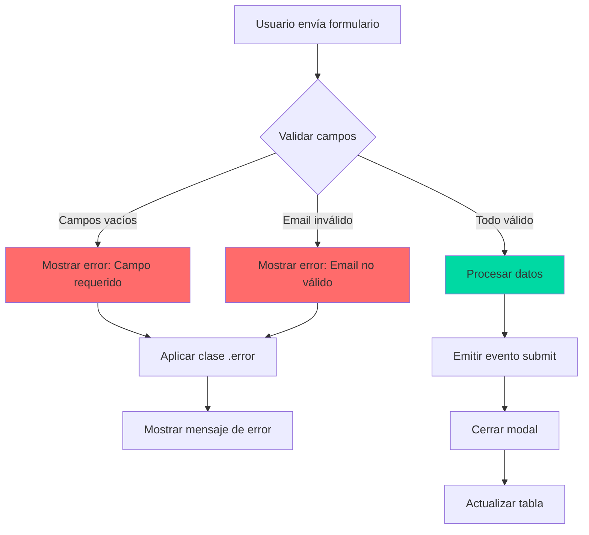
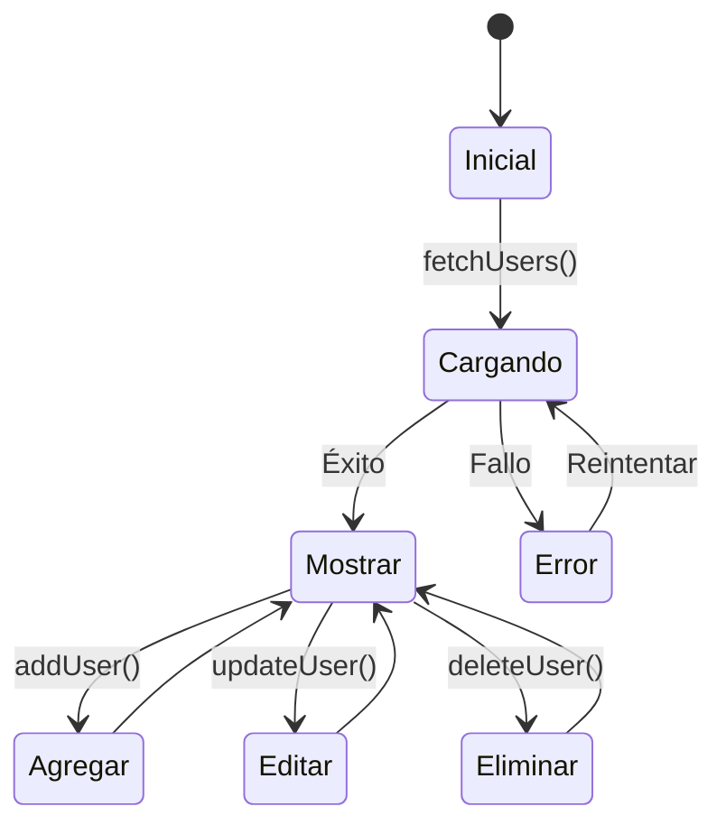

# Sistema de Gestión de Usuarios - CRUD

Aplicación web moderna desarrollada con Vue.js 3 que implementa un sistema CRUD completo para la gestión de usuarios, consumiendo la API pública de JSONPlaceholder.

## Tabla de Contenidos

- [Características](#características)
- [Tecnologías Utilizadas](#tecnologías-utilizadas)
- [Arquitectura del Sistema](#arquitectura-del-sistema)
- [Instalación y Ejecución](#instalación-y-ejecución)
- [Estructura del Proyecto](#estructura-del-proyecto)
- [Funcionalidades Implementadas](#funcionalidades-implementadas)
- [Patrones de Diseño](#patrones-de-diseño)
- [Validaciones y UX](#validaciones-y-ux)
- [Gestión de Estado](#gestión-de-estado)
- [Diseño Visual](#diseño-visual)
- [Pruebas Manuales](#pruebas-manuales)

## Características

### Funcionalidades Principales

- **Listado de Usuarios**: Tabla interactiva con datos obtenidos de la API
- **Agregar Usuario**: Formulario modal con validación completa
- **Editar Usuario**: Modificación de datos existentes con pre-carga
- **Eliminar Usuario**: Confirmación de seguridad antes de eliminar
- **Validación de Formularios**: Validación en tiempo real con mensajes específicos
- **Estados de Carga**: Indicadores visuales durante operaciones asíncronas
- **Diseño Responsivo**: Interfaz adaptable a diferentes dispositivos
- **Manejo de Errores**: Gestión centralizada de errores de API

### Características Técnicas

- Vue.js 3 con Composition API
- Componentes reutilizables y modulares
- Composables para lógica compartida
- Variables de entorno para configuración
- Iconos SVG profesionales (Lucide)
- CSS personalizado sin frameworks externos
- Código limpio sin console.log ni comentarios innecesarios

## Tecnologías Utilizadas

| Tecnología | Versión | Propósito |
|------------|---------|-----------|
| Vue.js | 3.4.15 | Framework JavaScript reactivo |
| Vite | 5.0.11 | Build tool y dev server |
| Lucide Vue Next | Latest | Librería de iconos SVG |
| CSS3 | - | Estilos personalizados |
| Fetch API | - | Consumo de API REST |

## Arquitectura del Sistema

### Diagrama de Componentes



### Flujo de Datos



### Arquitectura de Capas



## Instalación y Ejecución

### Requisitos Previos

- Node.js versión 16 o superior
- npm o yarn

### Pasos de Instalación

#### 1. Clonar el repositorio

```bash
git clone <tu-repositorio>
cd df_pruebatecnica_myper
```

#### 2. Configurar variables de entorno

Copia el archivo `.env.example` a `.env`:

```bash
cp .env.example .env
```

El archivo `.env` contiene la configuración de la API:

```env
VITE_API_BASE_URL=https://jsonplaceholder.typicode.com
```

#### 3. Instalar dependencias

```bash
npm install
```

#### 4. Ejecutar en modo desarrollo

```bash
npm run dev
```

La aplicación estará disponible en `http://localhost:5173`

#### 5. Compilar para producción

```bash
npm run build
```

Los archivos compilados estarán en el directorio `dist/`

## Estructura del Proyecto

```
df_pruebatecnica_myper/
├── src/
│   ├── components/              # Componentes Vue reutilizables
│   │   ├── UserTable.vue        # Tabla de usuarios con acciones
│   │   ├── UserModal.vue        # Modal para agregar/editar
│   │   └── DeleteConfirmation.vue # Confirmación de eliminación
│   │
│   ├── composables/             # Lógica reutilizable
│   │   └── useUsers.js          # Gestión de estado de usuarios
│   │
│   ├── styles/                  # Estilos globales
│   │   └── main.css             # Sistema de diseño personalizado
│   │
│   ├── App.vue                  # Componente raíz
│   └── main.js                  # Punto de entrada
│
├── .env                         # Variables de entorno (no versionado)
├── .env.example                 # Plantilla de variables de entorno
├── .gitignore                   # Archivos ignorados por Git
├── index.html                   # HTML principal
├── package.json                 # Dependencias y scripts
├── vite.config.js               # Configuración de Vite
└── README.md                    # Documentación del proyecto
```

## Funcionalidades Implementadas

### 1. Listado de Usuarios

**Endpoint**: `GET https://jsonplaceholder.typicode.com/users`

**Características**:
- Obtención de datos desde la API al cargar la aplicación
- Almacenamiento local en array reactivo
- Indicador de carga durante la petición
- Visualización en tabla con columnas: ID, Nombre, Usuario, Email, Teléfono
- Estado vacío cuando no hay usuarios

**Modelo de datos**:
```javascript
{
  id: 1,
  name: "Leanne Graham",
  username: "Bret",
  email: "Sincere@april.biz",
  phone: "1-770-736-8031 x56442"
}
```

### 2. Agregar Usuario

**Características**:
- Formulario modal con validación
- Validación de email con expresión regular
- Generación automática de ID secuencial
- Almacenamiento local (no se envía a la API)
- Todos los campos son requeridos

**Validaciones**:
- Nombre: requerido, no vacío
- Usuario: requerido, no vacío
- Email: requerido, formato válido
- Teléfono: requerido, no vacío

### 3. Editar Usuario

**Características**:
- Modal pre-rellenado con datos actuales
- Actualización en el array local por ID
- Mismas validaciones que agregar usuario
- Feedback visual de éxito

### 4. Eliminar Usuario

**Características**:
- Modal de confirmación antes de eliminar
- Mensaje descriptivo con nombre del usuario
- Opción de cancelar
- Eliminación del array local

## Patrones de Diseño

### Composition API

El proyecto utiliza la Composition API de Vue 3 para una mejor organización del código:

```javascript
// useUsers.js - Composable Pattern
export function useUsers() {
  const users = ref([])
  const loading = ref(false)
  
  const fetchUsers = async () => { /* ... */ }
  const addUser = (userData) => { /* ... */ }
  
  return { users, loading, fetchUsers, addUser }
}
```

### Componentes Reutilizables

**UserModal**: Componente genérico que sirve tanto para agregar como para editar usuarios mediante props dinámicos.

```vue
<UserModal
  :user="selectedUser"
  :title="modalTitle"
  :submitText="modalSubmitText"
  @close="closeModal"
  @submit="handleSubmit"
/>
```

### Separación de Responsabilidades

| Capa | Responsabilidad | Archivos |
|------|----------------|----------|
| Presentación | UI y eventos de usuario | `*.vue` templates |
| Lógica | Estado y operaciones CRUD | `useUsers.js` |
| Validación | Reglas de negocio | `UserModal.vue` |
| Estilos | Diseño visual | `main.css` |

## Validaciones y UX

### Sistema de Validación



### Validación de Email

```javascript
const validateEmail = (email) => {
  const emailRegex = /^[^\s@]+@[^\s@]+\.[^\s@]+$/
  return emailRegex.test(email)
}
```

### Estados de la Aplicación

| Estado | Componente | Indicador Visual |
|--------|-----------|------------------|
| Cargando | UserTable | Spinner animado |
| Vacío | UserTable | Icono + mensaje |
| Error | useUsers | Mensaje de error |
| Éxito | - | Actualización de tabla |

## Gestión de Estado

### Estado Reactivo

```javascript
const users = ref([])        // Lista de usuarios
const loading = ref(false)   // Estado de carga
const error = ref(null)      // Mensajes de error
```

### Flujo de Operaciones CRUD



### Generación de IDs

```javascript
const addUser = (userData) => {
  const newId = users.value.length > 0 
    ? Math.max(...users.value.map(u => u.id)) + 1 
    : 1
  
  users.value.push({ id: newId, ...userData })
}
```

## Diseño Visual

### Paleta de Colores

| Color | Hex | Uso |
|-------|-----|-----|
| Ocean | `#0a4d68` | Títulos, headers |
| Teal | `#088395` | Botones primarios |
| Mint | `#05bfdb` | Acentos, gradientes |
| Cream | `#00ffca` | Highlights |
| Success | `#00d9a3` | Botones de éxito |
| Danger | `#ff6b6b` | Botones de peligro |

### Sistema de Diseño

**Gradiente de fondo**:
```css
background: linear-gradient(145deg, #0a4d68 0%, #088395 50%, #05bfdb 100%);
```

**Elementos distintivos**:
- Barra superior multicolor en contenedor (6px)
- Subrayado animado en header (120px teal)
- Efecto ripple en botones
- Gradiente horizontal en hover de tabla
- Spinner dual-color con easing personalizado
- Modal con borde superior teal (5px)

### Responsive Design

| Breakpoint | Ancho | Ajustes |
|------------|-------|---------|
| Desktop | > 768px | Layout completo |
| Tablet | ≤ 768px | Botones apilados |
| Mobile | < 768px | Tabla con scroll |

## Pruebas Manuales

### Caso 1: Carga Inicial

**Pasos**:
1. Abrir `http://localhost:5173`
2. Observar spinner de carga
3. Verificar que aparecen 10 usuarios

**Resultado esperado**: Tabla con 10 usuarios de la API

### Caso 2: Agregar Usuario

**Pasos**:
1. Click en "Agregar Usuario"
2. Completar formulario:
   - Nombre: "Juan Pérez"
   - Usuario: "jperez"
   - Email: "juan@example.com"
   - Teléfono: "123456789"
3. Click en "Guardar"

**Resultado esperado**: Usuario aparece en la tabla con ID 11

### Caso 3: Validación de Email

**Pasos**:
1. Click en "Agregar Usuario"
2. Ingresar email inválido: "notanemail"
3. Intentar guardar

**Resultado esperado**: 
- Borde rojo en campo email
- Mensaje: "El email no es válido"
- Formulario no se envía

### Caso 4: Editar Usuario

**Pasos**:
1. Click en "Editar" de cualquier usuario
2. Modificar el username
3. Click en "Actualizar"

**Resultado esperado**: Cambios reflejados en la tabla

### Caso 5: Eliminar Usuario

**Pasos**:
1. Click en "Eliminar" de cualquier usuario
2. Leer mensaje de confirmación
3. Click en "Eliminar"

**Resultado esperado**: Usuario eliminado de la tabla

### Caso 6: Responsive

**Pasos**:
1. Redimensionar ventana a < 768px
2. Verificar adaptación de elementos

**Resultado esperado**:
- Botones apilados verticalmente
- Tabla con scroll horizontal
- Modal ajustado al ancho

## Código Limpio y Buenas Prácticas

### Principios Aplicados

**DRY (Don't Repeat Yourself)**:
- Composable `useUsers` para lógica compartida
- Componente `UserModal` reutilizable para agregar/editar

**Separación de Responsabilidades**:
- Componentes enfocados en una sola tarea
- Lógica de negocio separada de la presentación

**Código Limpio**:
- Sin `console.log()`
- Sin comentarios innecesarios
- Nombres descriptivos de variables y funciones
- Formato consistente

### Reutilización de Componentes

**UserModal** - Ejemplo de reutilización:

```javascript
// Modo Agregar
<UserModal
  :user="null"
  title="Agregar Usuario"
  submitText="Guardar"
/>

// Modo Editar
<UserModal
  :user="selectedUser"
  title="Editar Usuario"
  submitText="Actualizar"
/>
```

**Beneficios**:
- Menos código duplicado
- Mantenimiento centralizado
- Consistencia en la UI
- Facilita testing

## Deployment

### Build de Producción

```bash
npm run build
```

### Servicios Compatibles

- Vercel
- Netlify
- GitHub Pages
- Firebase Hosting
- AWS S3 + CloudFront

### Configuración de Deployment

**Output**: `dist/`  
**Build Command**: `npm run build`  
**Dev Command**: `npm run dev`

## Autor

Desarrollado como prueba técnica para **MYPER Software**

**Fecha de entrega**: Lunes 09 de febrero de 2026 - 09:00 a.m. (hora Perú)

---

## 🔗 Enlaces del Proyecto

- **Repositorio GitHub**: [https://github.com/Angelzaki/df_pt_myper](https://github.com/Angelzaki/df_pt_myper)
- **Video Demostración (Loom)**: Enlace enviado por correo electrónico

> **Nota**: El video de demostración incluye una explicación completa de las funcionalidades implementadas, la arquitectura del sistema y las decisiones técnicas tomadas durante el desarrollo.

---

## Licencia

Este proyecto fue desarrollado con fines educativos y de evaluación técnica.

Aplicación web moderna desarrollada con **Vue.js 3** que implementa un sistema CRUD completo para la gestión de usuarios, consumiendo la API pública de JSONPlaceholder.

## ✨ Características

- **Listado de Usuarios**: Tabla interactiva con datos obtenidos de la API
- **Agregar Usuario**: Formulario con validación de campos y email
- **Editar Usuario**: Modificación de datos existentes
- **Eliminar Usuario**: Confirmación antes de eliminar
- **Validación de Formularios**: Validación en tiempo real con mensajes de error
- **Estados de Carga**: Indicadores visuales durante operaciones asíncronas
- **Diseño Responsivo**: Interfaz adaptable a diferentes dispositivos
- **Animaciones Suaves**: Transiciones y efectos visuales modernos

## 🛠️ Tecnologías Utilizadas

- **Vue.js 3** (Composition API)
- **Vite** (Build tool)
- **CSS3** (Diseño moderno con gradientes y animaciones)
- **Fetch API** (Consumo de API REST)

## 📋 Requisitos Previos

- Node.js (versión 16 o superior)
- npm o yarn

## 🚀 Instalación y Ejecución

### 1. Clonar el repositorio

```bash
git clone <tu-repositorio>
cd df_pruebatecnica_myper
```

### 2. Configurar variables de entorno

Copia el archivo `.env.example` a `.env`:

```bash
cp .env.example .env
```

El archivo `.env` ya contiene la configuración necesaria:
```
VITE_API_BASE_URL=https://jsonplaceholder.typicode.com
```

### 3. Instalar dependencias

```bash
npm install
```

### 4. Ejecutar en modo desarrollo

```bash
npm run dev
```

La aplicación estará disponible en `http://localhost:5173`

### 5. Compilar para producción

```bash
npm run build
```

## 📁 Estructura del Proyecto

```
df_pruebatecnica_myper/
├── src/
│   ├── components/
│   │   ├── UserTable.vue          # Tabla de usuarios
│   │   ├── UserModal.vue          # Modal para agregar/editar
│   │   └── DeleteConfirmation.vue # Modal de confirmación
│   ├── composables/
│   │   └── useUsers.js            # Lógica de gestión de usuarios
│   ├── styles/
│   │   └── main.css               # Estilos globales
│   ├── App.vue                    # Componente principal
│   └── main.js                    # Punto de entrada
├── index.html
├── vite.config.js
└── package.json
```

## 🎯 Funcionalidades Implementadas

### 1. Listado de Usuarios
- Obtención de datos desde `https://jsonplaceholder.typicode.com/users`
- Almacenamiento local en array reactivo
- Indicador de carga durante la petición
- Visualización en tabla con: name, username, email, phone

### 2. Agregar Usuario
- Formulario modal con validación
- Validación de email con expresión regular
- Generación automática de ID secuencial
- Almacenamiento local (no se envía a la API)

### 3. Editar Usuario
- Modal pre-rellenado con datos actuales
- Actualización en el array local por ID
- Validación de campos

### 4. Eliminar Usuario
- Modal de confirmación antes de eliminar
- Eliminación del array local
- Mensaje descriptivo con nombre del usuario

## 🎨 Diseño

- **Paleta de colores única**: Océano (#0a4d68), Teal (#088395), Mint (#05bfdb)
- **Gradiente de fondo**: 3 colores (océano → teal → mint) con attachment fixed
- **Elementos distintivos**:
  - Barra superior multicolor en contenedor
  - Subrayado animado en header
  - Efecto ripple en botones
  - Gradiente horizontal en hover de tabla
  - Spinner dual-color con easing personalizado
- **Tipografía**: Inter (Google Fonts) con pesos 300-800
- **Animaciones personalizadas**: slideUp, fadeIn, spin con cubic-bezier
- **Diseño responsivo** para móviles y tablets
- **100% CSS personalizado** (sin librerías UI externas)

## 📝 Validaciones

- Todos los campos son requeridos
- Email debe tener formato válido (regex)
- Mensajes de error específicos por campo
- Validación en tiempo real

## 🔄 Gestión de Estado

- **Composition API** con `ref` y `computed`
- **Composable personalizado** (`useUsers`) para lógica reutilizable
- **Estado reactivo** para usuarios, loading y errores

## 📱 Responsive Design

- Adaptación automática a diferentes tamaños de pantalla
- Tabla con scroll horizontal en móviles
- Botones apilados verticalmente en pantallas pequeñas
- Modal optimizado para dispositivos móviles

## 🧪 Pruebas Manuales

1. **Cargar usuarios**: Verificar que se muestren los 10 usuarios de la API
2. **Agregar usuario**: Crear un nuevo usuario con datos válidos
3. **Validación**: Intentar guardar con email inválido
4. **Editar usuario**: Modificar datos de un usuario existente
5. **Eliminar usuario**: Confirmar y eliminar un usuario
6. **Responsividad**: Probar en diferentes tamaños de pantalla

## 👨‍💻 Autor

Desarrollado como prueba técnica para **MYPER Software**

## 📅 Fecha de Entrega

Lunes 09 de febrero de 2026 - 09:00 a.m. (hora Perú 🇵🇪)
